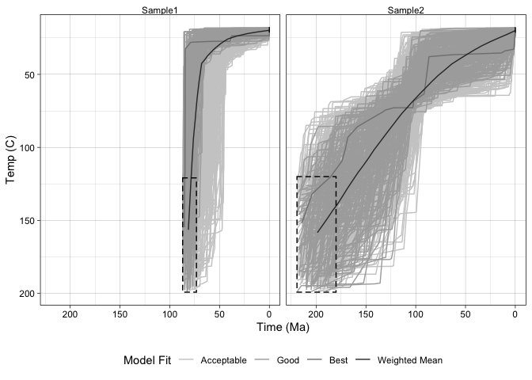
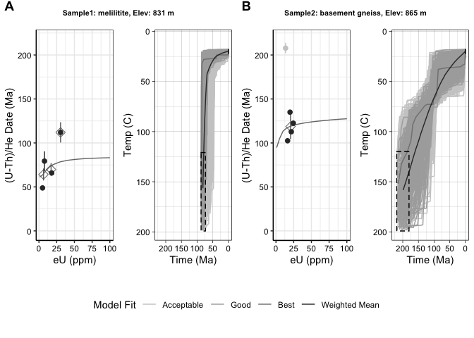

<!-- README.md is generated from README.Rmd. Please edit that file -->

# thermochronplotr

<!-- badges: start -->

<!-- badges: end -->

The goal of thermochronplotr is to make several commonly used plots for
low temperature thermochronology, particularly apatite (U-Th)/He
thermochronology, from data files. Ideally this makes plotting more
streamlined, while giving the user the option to customize aesthetics
using the wide range of tools in the ggplot2 package.

There several functios which import the text files output by the thermal
history modelling software HeFTy at the end of an inverse model run and
plots them as a single panel (for one model) or a faceted grid (for
multiple models)

This can also make make date-eU plots from the AHe data and plot these
as a shuffled grid with HeFTy models to show data and models side by
side.

## Installation

This package is only available on github. To install this please install
`devtools` package within R. Then:

``` r
devtools::install_github('jstanley26/thermochronplotr')
```

## Example

This is a basic example which shows you how to solve a common problem:

``` r
library(thermochronplotr)
#> Loading required package: rlang
```

### Single HeFTy inversion plot

For a single inversion model using the example file (replace with your
own when
ready)

``` r
fn=system.file("extdata","HeFTyOut-Sample1.txt",package="thermochronplotr")
samplename = 'Sample 1'
cons = readconstraints(fn,samplename)
dfplot = readpaths(fn,samplename)
plot1 = plot_hefty_output(dfplot, cons)
plot1
```


`plot1` is a `ggplot2` opject, and can be customized accordingly. For
example, if you want to change the x axis limits

``` r
library(ggplot2)
plot1+coord_cartesian(xlim=c(200,0))
#> Coordinate system already present. Adding new coordinate system, which will replace the existing one.
```


### Multiple HeFTy inversion facet

To plot the results from multple inversions, for example from more than
one sample, you need to create a vector of the file names, and a
coresponding vector of the sample names (in the same
order)

``` r
fn=system.file("extdata","HeFTyOut-Sample1.txt",package="thermochronplotr")
samplename = 'Sample1'
fn2=system.file("extdata","HeFTyOut-Sample2.txt",package="thermochronplotr")
samplename2 = 'Sample2'

fns = c(fn, fn2)
sns = c(samplename,samplename2)

cons2 = readconstraints(fns,sns)
dfplot2 = readpaths(fns,sns)
plot2 = plot_hefty_output(dfplot2, cons2)
plot2
```



Again, `plot2` is a `ggplot` object and can be customized

### date-eU plots for multiple samples

To use this function you must first create or read in a dataframe with
(U-Th)/He data that has columns labeled “eU”, “Date”, “Unc”,“Color”, and
“Sample”, where eU is the effective Uranium, Date is the (U-Th)/He date,
Unc is the uncertaity (for error bars), and Sample is the sample name
(only truly required if you have more than one sample you are trying to
plot). “Color” is a column by which you can color the data points, for
example you might have most of the data in black, but a few data points
that are outliers to be plotted in grey that info is contained in the
“Color” column.

``` r
fn=system.file("extdata","AHe_data.csv",package="thermochronplotr")
hedf<-readr::read_csv(fn)
#> Warning: Missing column names filled in: 'X1' [1]
#> Parsed with column specification:
#> cols(
#>   .default = col_double(),
#>   Sample = col_character(),
#>   Grain = col_character(),
#>   Color = col_character(),
#>   Description = col_character(),
#>   Elevation_m = col_character(),
#>   Sample_cat = col_character()
#> )
#> See spec(...) for full column specifications.
plot3 = plot_date_eu(hedf)
plot3
```

 If
you have split your data into bins to model in heFTy, you can denote
where these are separated with vertical dashed lines by inputing the
`eUbin` value(s) for example if your low eU bin was \<15ppm, you would
put in `eUbin=15`. If you had low, medium, and high eU bins split at
\<15ppm, 15-30 ppm, and \>30ppm, you would put in `eUbin=c(15,30)`.

If you had forward models that you want to plot predicted date-eU paths
you can plot these by adding a second dataframe, `bestfitdf`, with those
predictions. Again this dataframe needs to have columns “Date” and “eU”
(and “Sample” if there are multiple
samples):

``` r
fn2=system.file("extdata","ForwardModels.csv",package="thermochronplotr")
bestfitdf <- readr::read_csv(fn2)
#> Warning: Missing column names filled in: 'X1' [1]
#> Parsed with column specification:
#> cols(
#>   X1 = col_double(),
#>   eU = col_double(),
#>   Date = col_double(),
#>   Sample = col_character(),
#>   Description = col_character(),
#>   Elevation_m = col_character(),
#>   Sample_cat = col_character()
#> )
plot4 = plot_date_eu(hedf,bestfitdf,eUbin=c(15,30))
plot4
```


Again, plots 3 and 4 are ggplot objects that can be modified

### Shuffling HeFTy and Date-eU plots

Often it is nice to look at the data and the models together, so we can
create a plot that places them side by side for the same sample. The
inputs are the same as for the individual HeFTy or date-eU plots, so we
can use the dataframes loaded earlier in the examples. Note that it is
required that you have a forward model `bestfitdf` to run this function.

``` r
plot5 = shuffle_plots(hedf,bestfitdf,dfplot2,cons2)
plot5
```

 Axis
limits are the same across the shuffled grid and can be input manually
or are calculated from the total dataset
